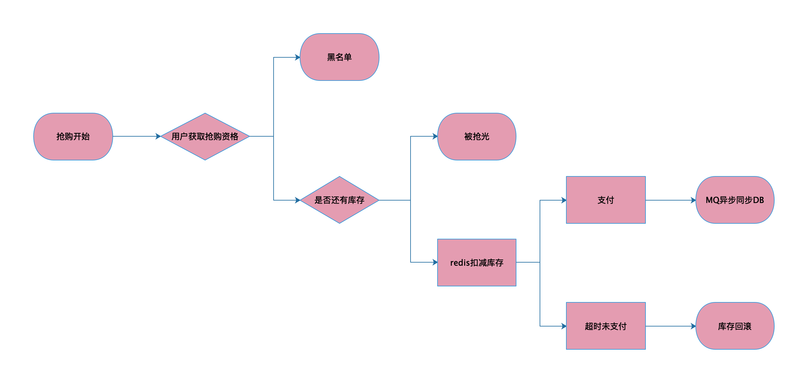

# 秒杀架构设计



秒杀请求：
```text

curl --location --request POST 'http://localhost:7009/order/seckill' \
--header 'Content-Type: application/json' \
--data-raw '{
	"goodsId":1,
	"number":12,
	"userId":4
}'

其他/pre或者/commit/{id}，是另外一种不完美的方案，可以不考虑

```

## 秒杀系统特点
1. 时间极短
2. 瞬间请求的量非常大

## 注意点
1. 不能超卖 ( 直接的经济损失, 平台信誉受损)

2. 防黑产,黄牛 (阿里月饼门) : 机器的请求速度比人的手速快太多了.

3. 瞬间爆发的高流量

   * 典型的读多写少的场景  （cache 缓存)
   * 页面静态化 ,利用cdn服务器缓存前端文件
   * 按钮置灰3秒. (利用风控规则过滤掉非法用户)
   * 接口层可以做开关限流( 一旦抢购结束,则直接返回失败).
   * 堆机器, 搭建集群. 利用nginx做负载均衡.
   * 热点隔离 增加资源  有限放流(熔断)  多次请求合并为一次

4. 尽量把请求拦截在上层.  Mysql性能没有redis优秀

   Mysql单机读能力为5k, 写能力为3k.

   redis单机读能力最高可达10w, 写能力能达到3-5w.

5. 预热. 运营人员提前将数据写入redis.

6. 异步去扣减库存。 (消息队列)


## 支付超时问题

秒杀一般比较少超时情况，但是还是考虑由于各种原因，用户抢购了，但是未支付，那就需要重新回滚库存的问题。解决方案可以考虑如下：
- 如果业务允许，可以使用先支付确保抢购资格，再秒杀。
- 分布式的定时任务，扫描DB并更新DB

这种方案，会有一个时差的问题，但是不影响最终多卖和少买问题。因为其实用户支付最后还是会通过redis查询是否抢购成功标示还在，如果不在，就不会发起支付流程。
